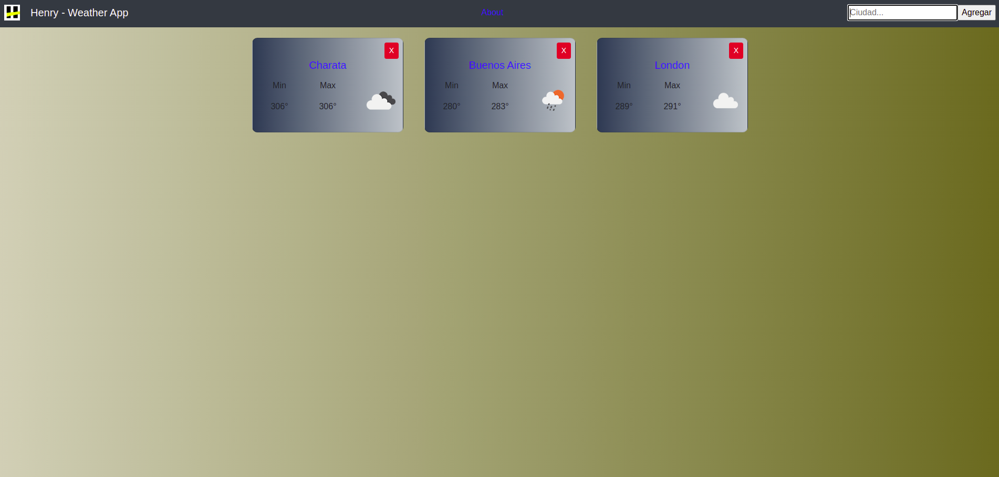

## App Web del tiempo


### Sobre el proyecto

Este es unos de los primeros proyecto realizados en el bootcamp. Una app para poder buscar la temperatura de cualquier ciudad del mundo. 


#### Construido con

- React
-React-Router
-CSSModule

### Empezando

Este proyecto se inició con la app estándar de create-react

#### Intalación

En el directorio del proyecto

```shell
npm install
```

Luego

```shell
npm start
```
Abra http: // localhost: 3000 para verlo en el navegador.

### Ejemplo



### Contacto

Luciano Nicolas Pereira - pereiralucianonicolas@gmail.com

<p aling='center'>
  <a href='https://www.linkedin.com/in/luciano-nicolas-pereira-dev'>
    
  </a>
</p>